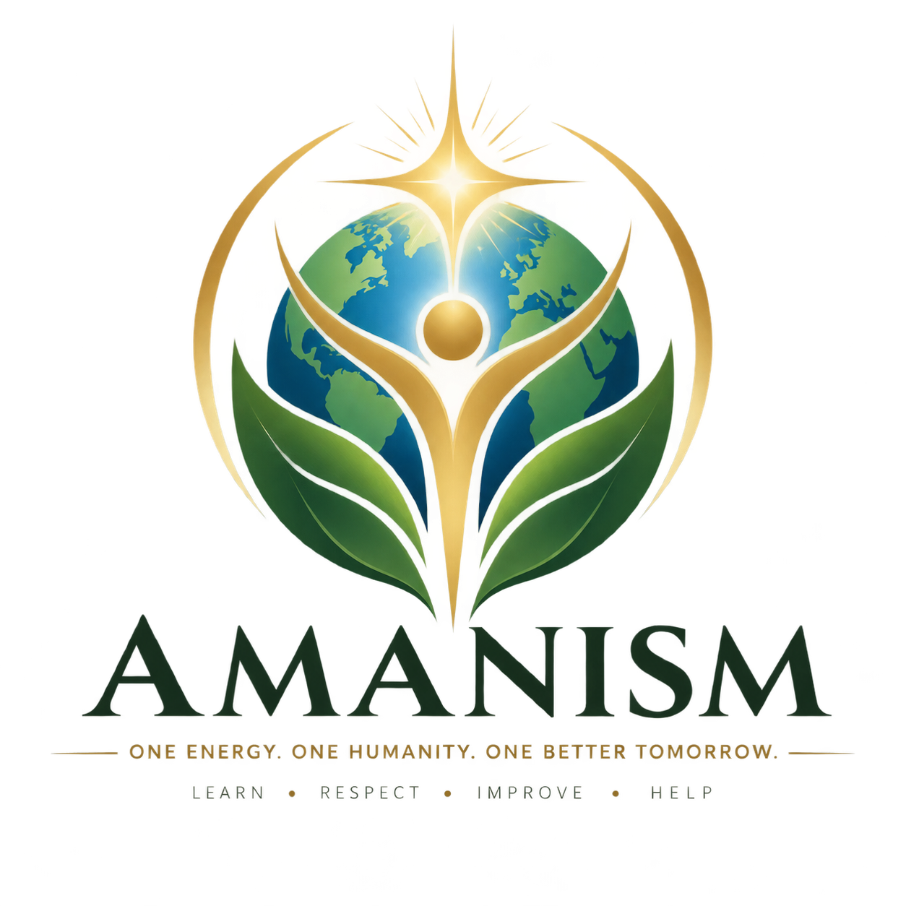

# AMANISM

### One Energy. One Humanity. One Better Tomorrow.

**An open-source spiritual philosophy inspired by the wisdom of humanity.**

---

## 🌍 What is Amanism?

**Amanism** is an open-source spiritual philosophy based on the belief in **one universal God — Energy**.

Amanism respects every religion, culture, philosophy, and belief system. It seeks to discover and preserve the valuable teachings that humanity has developed throughout history and bring them together into a path focused on **humanity, self-improvement, wisdom, peace, and a better world**.

Amanism does not exist to replace, attack, or discriminate against any religion.

> **Learn from humanity. Respect every belief. Keep what makes us better.**

---

## ⚡ One Energy

Amanism believes in **one universal Energy** as the ultimate reality behind existence.

Every person can seek a direct connection with Energy.

There is no requirement for a:

- Religious intermediary

Teachers and knowledgeable people may share their understanding, but **no human being is required to stand between an individual and Energy.**

---

## 🤝 One Humanity

Amanism believes that every human being deserves dignity and respect.

Religion, caste, nationality, language, wealth, gender, culture, or background should never be reasons to hate or discriminate against another person.

Amanism encourages:

- ❤️ Compassion
- 🤝 Cooperation
- 🕊️ Peace
- ⚖️ Equality
- 🧠 Knowledge
- 💪 Courage
- 🌱 Responsibility
- 🙏 Respect

---

## 🌎 A Better Vision of the World

Amanism aims to improve the way people see themselves, other people, nature, and the world.

It encourages a movement:

**From hatred → to understanding**

**From discrimination → to equality**

**From ignorance → to learning**

**From selfishness → to compassion**

**From division → to humanity**

**From blind acceptance → to thoughtful understanding**

**From unnecessary consumption → to responsible living**

---

## 🧘 Daily Revision

Meditation is an important Amanist practice.

It is not only about sitting silently. It is also a time to **review the entire day**.

Ask yourself:

> What did I learn today?  
> What good did I do?  
> Did I hurt anyone?  
> Did I harm the environment?  
> What made me genuinely happy?  
> What mistake can I learn from?  
> How can I become better tomorrow?

### Learn → Reflect → Improve → Repeat

---

## 📚 Wisdom From Humanity

Amanism respects the wisdom found across the world's religions and philosophies.

This includes, but is not limited to:

- Hinduism
- Buddhism
- Jainism
- Sikhism
- Islam
- Christianity
- Judaism
- Taoism
- Indigenous traditions
- Other spiritual traditions
- Secular philosophies
- Science and human experience

Amanism does **not** claim that every teaching from these traditions is automatically correct.

Instead:

> **Learn from everyone. Question everything. Keep what helps humanity.**

All traditions should be studied respectfully and in their proper historical and cultural context.

---

## 🔬 Science & Reason

Amanism respects:

- Science
- Evidence
- Reason
- Critical thinking
- Curiosity
- Open discussion
- Freedom of questioning

Amanism encourages people to explore the **external world through science** and the **internal world through meditation and self-reflection**.

---

## 🌱 Environment

Humanity is part of nature, not separate from it.

Amanism encourages people to:

- Protect nature
- Keep surroundings clean
- Reduce unnecessary waste
- Use resources responsibly
- Protect animals and biodiversity
- Reduce environmental harm
- Leave a better world for future generations

---

## 🍎 Food & Nutrition

Amanism does not discriminate against people because of their food choices.

People may choose vegetarian or non-vegetarian food according to their:

- Nutritional needs
- Health
- Culture
- Beliefs
- Personal choice

The emphasis is on:

**Nutrition + Moderation + Responsibility + Respect for life and nature**

---

## 💰 Wealth & Responsibility

Amanism does not consider earning money wrong.

People should work, learn, build, and earn enough to fulfill their **needs and responsibilities**.

However, endless accumulation of wealth should not become the ultimate purpose of life.

When our essential needs and responsibilities are fulfilled, we should use our:

**Time + Knowledge + Skills + Resources**

to help people who are in need and contribute to society.

> **Earn to live. Live to improve. Improve to help.**

---

# 📖 Chapters of Amanism

Amanism will be organized into different chapters:

| Chapter | Subject |
|---|---|
| 01 | Core Principles |
| 02 | Good Energy |
| 03 | Meditation |
| 04 | Human Life |
| 05 | Death & Afterlife |
| 06 | Science & Reason |
| 07 | Philosophy |
| 08 | Practices |
| 09 | Wisdom of Humanity |
| 10 | Scriptures & Teachings |
| 11 | Symbols |
| 12 | Festivals & Calendar |
| 13 | Community |
| 14 | Translations |

Each chapter will be developed gradually through research, discussion, experience, and contributions.

---

# 🌍 Open Source — Built by Humanity

**Amanism is a work in progress.**

It is not intended to be a finished doctrine created by one person.

Everyone is welcome to contribute:

- 💡 Ideas
- 📝 Teachings
- 📚 Research
- 🌐 Translations
- 🧠 Philosophical discussions
- 🔍 Constructive criticism
- 🤝 Community practices
- 🌱 Ideas for improving humanity

Contributions should be respectful and should aim to improve the philosophy and its impact on humanity.

> **No individual — including the founder — is the final authority.**

---

## 🤝 Contributing

If you have an idea that could improve Amanism:

1. Read `CONTRIBUTING.md`
2. Open an Issue to discuss your idea
3. Discuss it respectfully with other contributors
4. Create a Pull Request when appropriate
5. Allow the community to review and improve it

Amanism should evolve through **open discussion and collective wisdom**.

---

# 🕊️ Our Vision

> **A world where people respect every belief, learn from one another, think beyond divisions, improve themselves, help those in need, protect the planet, and live together as one humanity.**

---

# ⚡ Motto

### **Learn from everyone. Respect everyone. Think for yourself. Connect with Energy. Help humanity.**

---

### ⚡ ONE ENERGY
### 🌍 ONE HUMANITY
### 🌱 ONE BETTER TOMORROW

**Amanism v0.1 — Open for Humanity**

